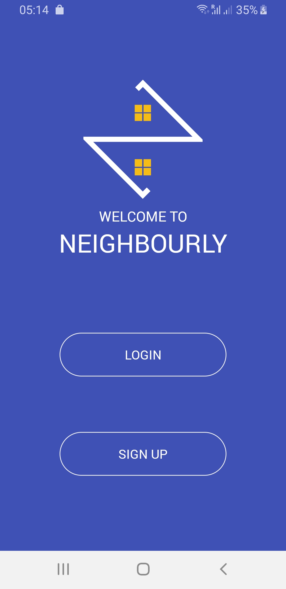
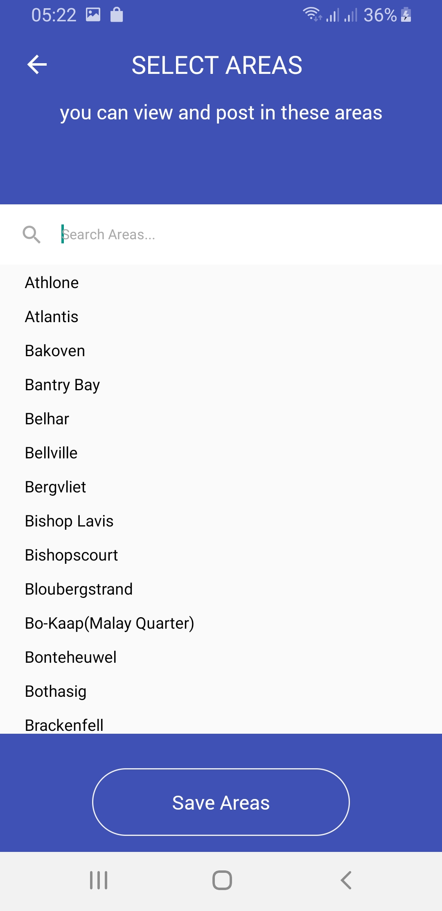

# Community Notice System

Capstone - Community Notice System

A platform which allows community members to communicate. Within this project we have created a cross-platform mobile application, backend + API and a web application with an
analytics dashboard.

## Developers

_This project was developed by the following people:._

- [Sheldon Reay](https://github.com/SheldonReay)
- [Daniel Vorster](https://github.com/danarent007)
- [Sabir Buxsoo](https://github.com/sabirbuxsoo)

# Demo Pictures

|            Welcome             |             Post Feed             |
| :----------------------------: | :-------------------------------: |
|  |  |

|             Event Feed             |             Search Areas             |
| :--------------------------------: | :----------------------------------: |
|  |  |

|             View Post             |             Logo              |
| :-------------------------------: | :---------------------------: |
|  |  |
